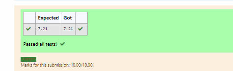

# DISTANCE-BETWEEN-TWO-POINTS

## AIM:
To write a python program to find the distance two 2 points
## ALGORITHM:
### Step 1:
import math 
### Step 2: 
declare x and y variable elements
### Step 3: 
Substitute the values in the distance formula  
### Step 4: 
to derive the value at 2 decimal points use slicing operator
### Step 5:
print value using format 
### PROGRAM:
```
#Program to find the distance between two points.
#Developed by: Haridharshini.s
#RegisterNumber:21500176
import math 
x=[10,4]
y=[6,2]
value=math.sqrt(((x[0]-x[1])**2)+((y[0]-y[1])**2))
print("{:.2f}".format(value))
```
### OUTPUT:


### RESULT:
thus the program to find the distance between two points is successfully executed.